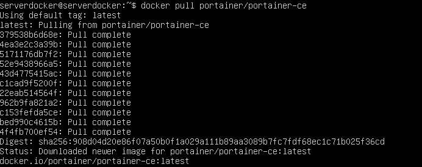
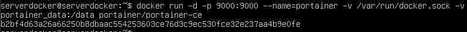
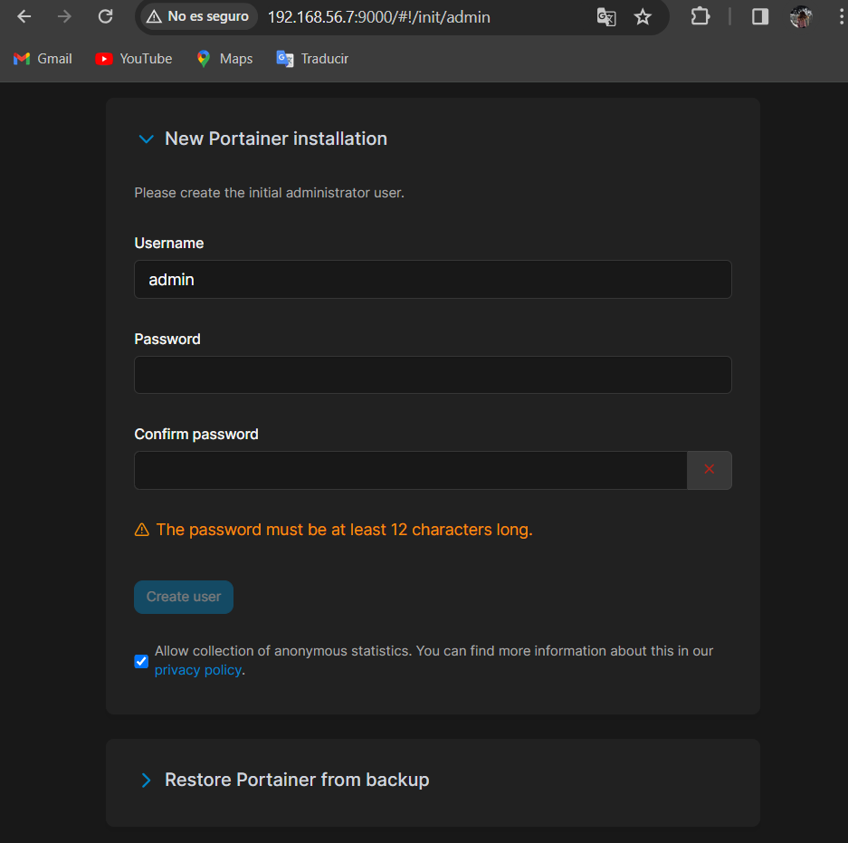
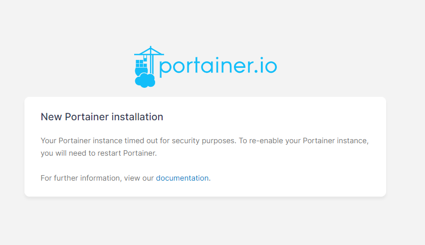
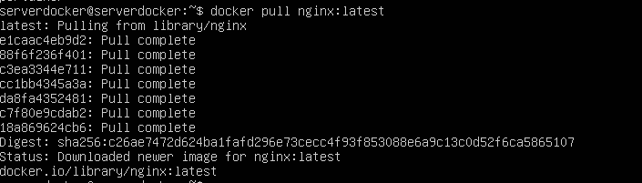
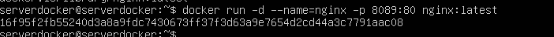
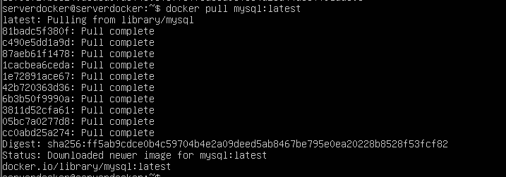
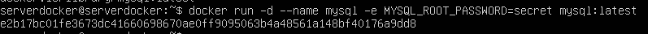

# Ejercicio 2

> Realizado por: Yolanda Frexes Avila el 27/02/2024

-Descargo la imagen del Portainer de DockerHub:

-Creo un contenedor de Portainer:

-Acceder a Portainer desde el navegador:

-Descargo dos imágenes:

