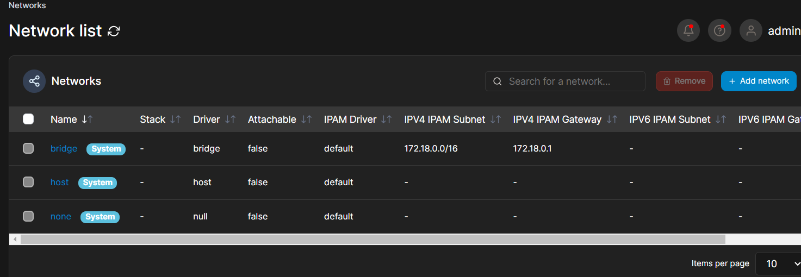

# Ejercicio 2

> Realizado por: Yolanda Frexes Avila el 27/02/2024

-Descargo la imagen del Portainer de DockerHub y creo un contenedor:

-Acceder a Portainer desde el navegador:

-Descargo dos imágenes:

Veo los contenedores que tengo un mi entorno de Docker:

-El ejercicio nos pide que paremos uno de nuestros contenedores, en este caso lo hice desde la interfaz :

-A continuación debemos de borrar uno de nuestros contenedores, en este caso voy a borrar el de mysql:

-Nos piden que realicemos una operación con redes Docker, así que voy a crear una conexión nueva:

Estas son las redes que teníamos hasta el momento

La red nueva:

La nueva red se puede configurar con las especificaciones que nosotros le demos, por el momento la he dejado con su configuración por defecto, y después de crearla ya la tenemos operativa con el resto de redes que teníamos anteriormente.

-Nuevamente se nos pide que realizamos esta vez una operación con volúmenes Docker, lo que voy a hacer es desde la interfaz del portainer crear un nuevo volumen de Docker:

Estos son los volúmenes que tenemos en nuestro entorno de momento.

Creamos un nuevo volumen al cual como anteriormente con la nueva conexión podemos aplicarle una serie de propiedades, esta vez, he decidido dejar las propiedades del volumen con su configuración por defecto.

Ya tenemos operativo con el resto de nuestros volúmenes Docker el nuevo volumen que acabamos de crear.