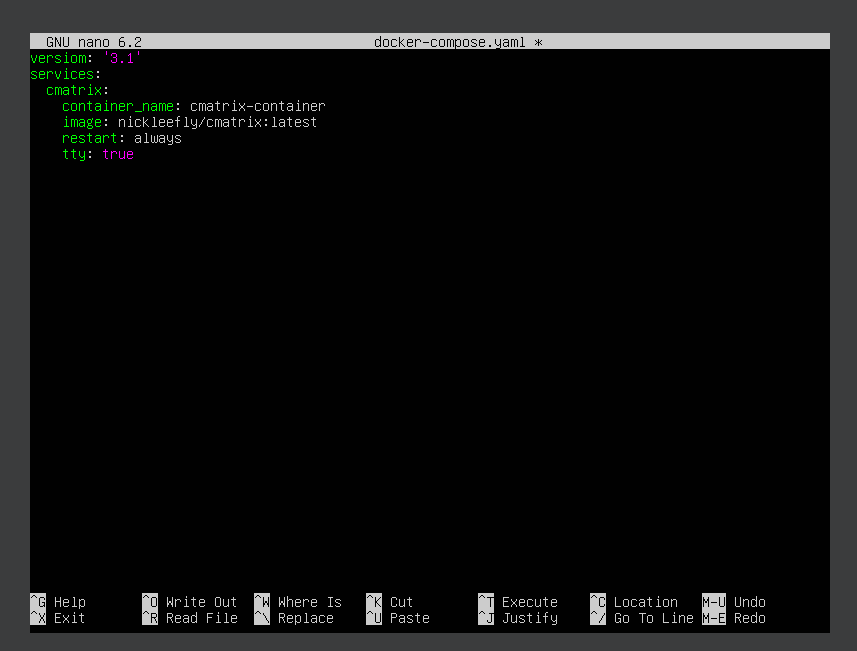
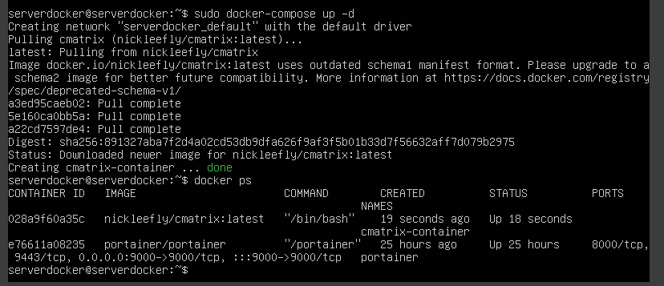
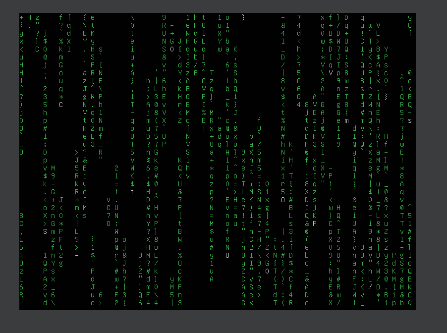

# Ejercicio 4

> Realizado por: Yolanda Frexes Avila 28/2/2024

-Fichero docker-compose.yaml:

-Captura de pantalla y documento donde se vea la aplicación funcionando. Se valorará conseguir el efecto Greenrain:

-Explicar brevemente cómo funciona esta aplicación:

 Cmatrix es una aplicación que genera una animación de caracteres verdes cayendo en tu terminal. Estos caracteres se generan aleatoriamente y parecen estar cayendo desde la parte superior de la pantalla hacia abajo. 

Para ver este efecto ejecutamos el siguiente comando:

Para referirme al servicio he indicado el ID que me ha generado el sistema para este.

Y conseguimos el efecto:

